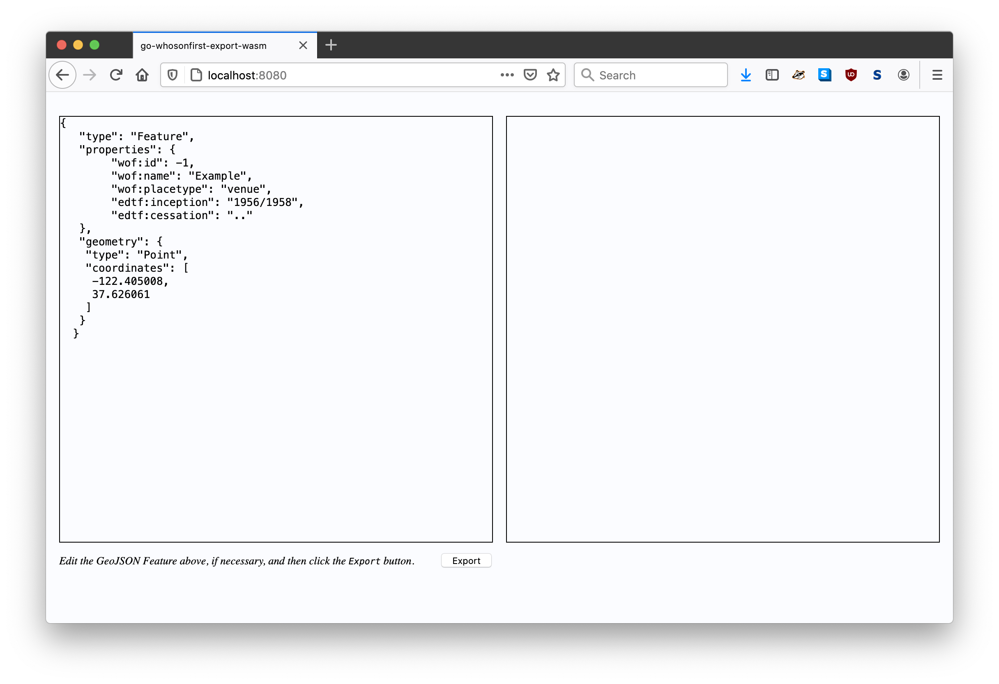
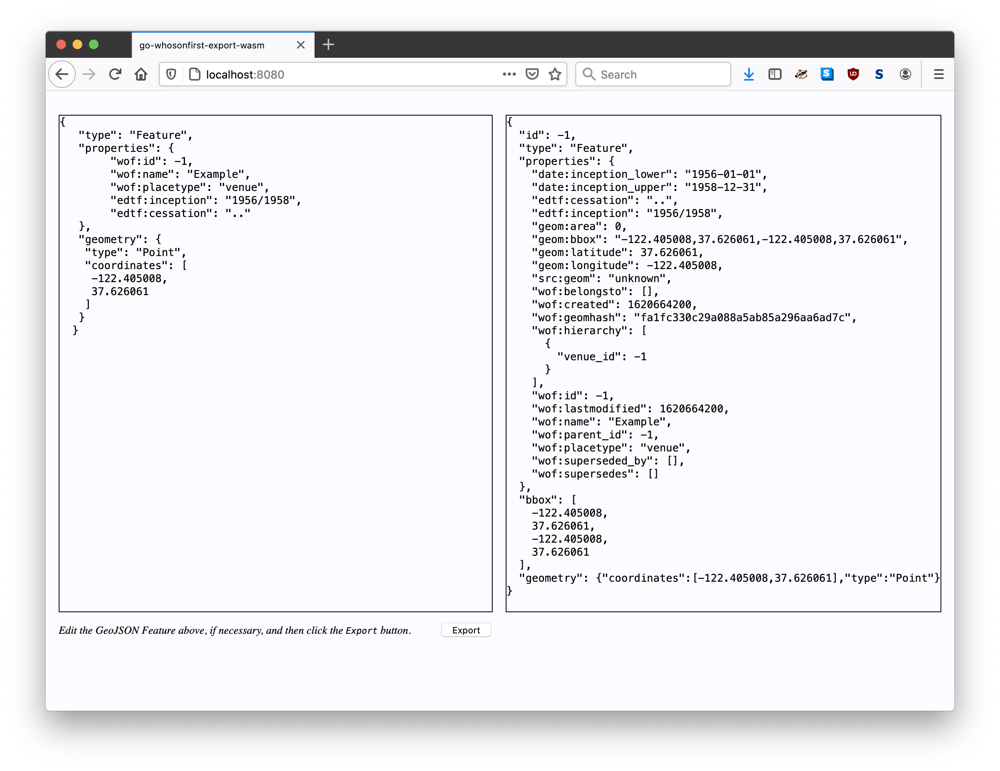

# go-whosonfirst-export-wasm

Go package for compiling the `Export` method of the go-whosonfirst-export package to a JavaScript-compatible WebAssembly (wasm) binary. It also provides a net/http middleware packages for appending the necessary static assets and HTML resources to use the wasm binary in web applications.

## Build

To build the `export_feature` WebAssembly binary for use in your applications run the following command:

```
GOOS=js GOARCH=wasm go build -mod vendor -o export_feature.wasm cmd/export-feature/main.go
```

## Use

To use the `export_feature` WebAssembly binary in your applications a JSON-encoded GeoJSON string to the `export_feature` function. The function returns a JavaScript `Promise` that will return a JSON-encoded Who's On First (WOF) GeoJSON string on success or an error message if there was a problem.

```
	var str_f = '{"type": "Feature" ... }'	// A valid GeoJSON Feature
	
	export_feature(str_f).then(rsp => {
	    console.log("WOF-exported feature is ", rsp);
	}).catch(err => {
	    console.log("Failed to export feature: ", err);
	});
```

In order to load the `export_feature` function you will need to include the `wasm_exec.js` and `whosonfirst.export.feature.js` JavaScript files, or functional equivalents. Both scripts are bundled with the package in the `static/javascript` folder.

## Middleware

The `go-whosonfirst-export-wasm/http` package provides methods for appending static assets and HTML resources to existing web applications to facilitate the use of the `export_feature` WebAssembly binary. For example:

```
package main

import (
	"embed"
	"flag"
	"fmt"
	wasm "github.com/whosonfirst/go-whosonfirst-export-wasm/http"
	"log"
	"net/http"
)

//go:embed index.html example.*
var FS embed.FS

func main() {

	host := flag.String("host", "localhost", "The host name to listen for requests on")
	port := flag.Int("port", 8080, "The host port to listen for requests on")

	flag.Parse()

	mux := http.NewServeMux()

	wasm.AppendAssetHandlers(mux)

	http_fs := http.FS(FS)
	example_handler := http.FileServer(http_fs)

	wasm_opts := wasm.DefaultWASMOptions()
	wasm_opts.EnableWASMExec()

	example_handler = wasm.AppendResourcesHandler(example_handler, wasm_opts)

	mux.Handle("/", example_handler)

	addr := fmt.Sprintf("%s:%d", *host, *port)
	log.Printf("Listening for requests on %s\n", addr)

	http.ListenAndServe(addr, mux)
}
```

_Error handling omitted for brevity._

There is a full working example of this application in the `cmd/example` folder. To run this application type the following command:

```
$> go run -mod vendor cmd/example/main.go
```

Then if you visit `http://localhost:8080` in your web browser you'll see something like this:



And when you click the `Export` button you'll see something like this:



The logic for the example application is defined in [cmd/example/example.init.js](cmd/example/example.init.js).

## See also

* https://github.com/whosonfirst/go-whosonfirst-export